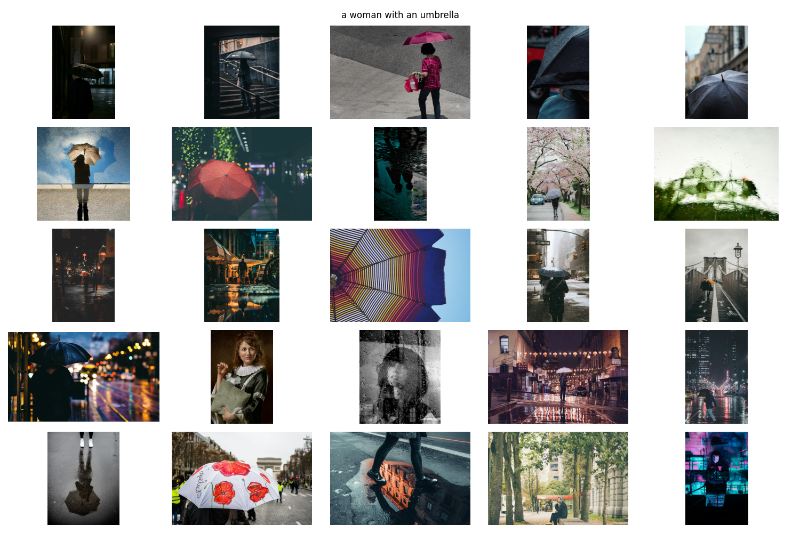
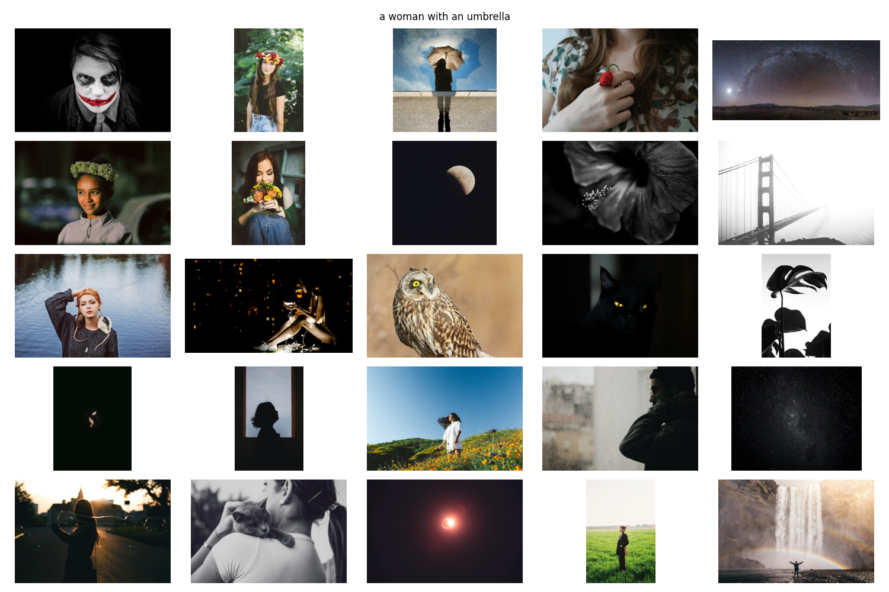
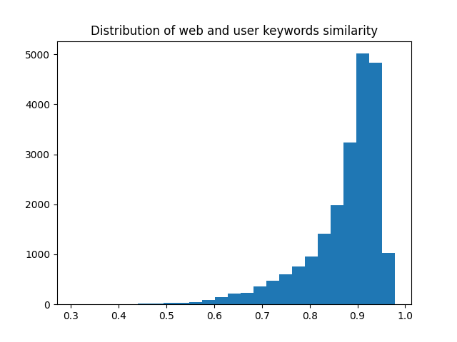
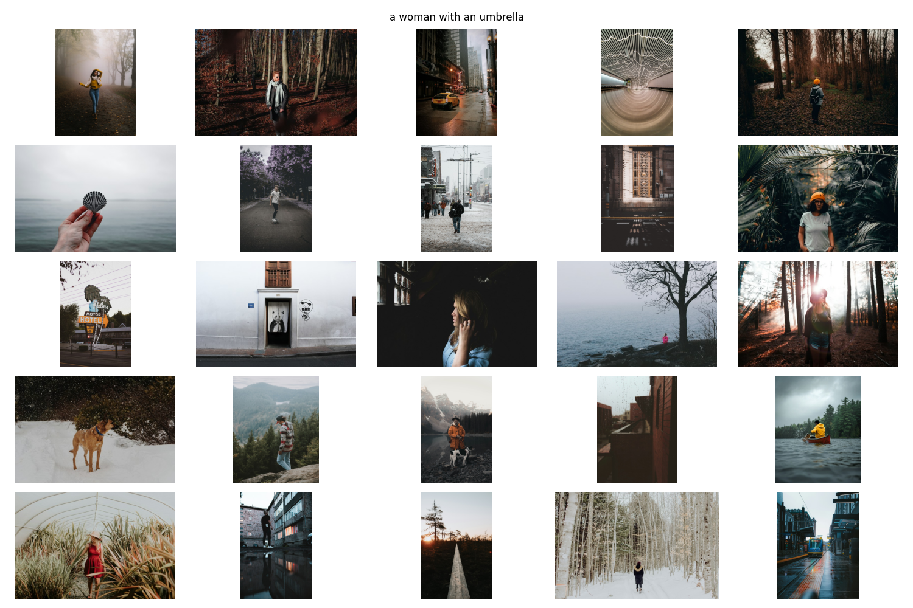

# Unsplash_User_Feedback_Finetuning
Enhancing CLIP-Based Image Search with User Feedback and Advanced Tag Management

## Description
This project aims to improve a CLIP-based model for image retrieval by leveraging user feedback, advanced tag management, and fine-tuning techniques. The goal is to enhance search relevance and personalization for the Unsplash dataset, making the model more responsive to user preferences and diverse query contexts.


## File Description
- **download_data.py**: Script for downloading the dataset.
- **merge_dataset.py**: Merges the different dataframes in the dataset using the "photo_id" value and drops rows with empty columns.
- **check_fix_tags.py**: Cleans user and web keywords by removing duplicates, improving tag relevance.
- **this_utils.py**: Utilities for searching in embeddings and displaying results.
- **clip_baseline.py**: Baseline script demonstrating CLIP's image retrieval capabilities. Results for three captions are stored in "results*" folders.
- **search_by_tag.py**: Explores tag-based search using BERT embeddings. Contains placeholders for discussing results.
- **how_similar_tags_user_web.py**: Analyzes the similarity between user and web keywords for images, indicating a high degree of overlap.
- **web_tag_to_user.py**: Experiment to translate web tag embeddings to user feedback tag space. The approach was not successful.
- **clip_finetuning.py**: Script for fine-tuning CLIP with dataset-specific captions.
- **clip_finetuned_top.py**: Outcomes of CLIP fine-tuning using raw keywords.
- **tag2text.py**: Utilizes the RAM model to convert images and keywords to captions more suited for CLIP.
- **clip_finetuned_top_captions.py**: Fine-tuning results using captions derived from user tags.


## Results
The project embarked on an exploratory journey to enhance image search accuracy and user experience using the CLIP model, integrated with user feedback. This endeavor unfolded through a series of methodical experiments, each contributing unique insights into the challenges and potentials of our approach.

### Downloading and Clearning Dataset
I downloaded the dataset with the script provided. There were various dataframes with various information. For this use case, I used the image path (to download the images), keywords (with information about the author provided keywords for each image) and user keywords (with infomation about what did users search for when downloading each image). The dataframes were merged into one using the "photo_id" column shared across them.
Since there where duplicates in those keyword lists, a keyword cleaning script was used to remove tags similar to others. This reduced some redundancy and noise in the data.

### Initial Baseline with CLIP
The project's first milestone was establishing a CLIP baseline. This foundational step proved to be a success, with CLIP demonstrating robust capabilities in retrieving relevant images. This encouraging start validated CLIP's potential as a core component of our solution, setting a high bar for subsequent enhancements.

These are the results from a cosine similarity search with CLIP-ViT-B/32 baseline. The results are 25 images ordered from top-left to bottom-right. The same query will be used in the different models used to see the differences. More results are in the "results*" folders.

### Tag Embeddings Search
Venturing into tag-based searches, the embeddings from a general multilingual BERT are used to match the user search with the average of keywords in the image. The average was set with the assumption that all tags have the same weight on the image (which can be weighted with additional dataset information in future steps). However, this approach did not yield the expected improvements. The disconnect between tag embeddings and actual user search intent highlighted the complexity of capturing nuanced user expectations, prompting a reevaluation of our strategies.


### Web vs. User Keyword Analysis
A comparative analysis of web and user keywords revealed surprising similarities, suggesting a potential for a translation model to bridge these spaces. 

Despite the initial promise, this idea was eventually discarded. The attempt to train a model for converting tag embeddings from web to user spaces encountered insurmountable obstacles, primarily due to the inherent non-alignment of these semantic spaces.

### Fine-tuning CLIP with Raw Tags
Finally, CLIP-ViT-B/32 was fine-tuned using raw user keywords as captions encountered significant challenges. The approach, which seemed plausible in theory, faltered in practice. CLIP's architecture and training methodology were not conducive to handling raw tags effectively, leading to a one-to-many problem where an image could relate to multiple tags across different training instances, diluting the model's focus and effectiveness. To mitigate this, for each image a prompt was developed like "an image with tags: [...]" with the list of user keywords. This didn't improve the CLIP baseline. The problem is the misaligment between these kind captions and what CLIP takes as input. Also, the images contained between 20 and 50 keywords (after clearning) which was also way larger than the CLIP context size. All this problems contributed to the bad results.



### User Feedback and CLIP-Friendly Captions
Incorporating user feedback, we ventured to create more CLIP-friendly captions. This phase involved transforming user keywords into narratives that CLIP could process more naturally. The subsequent fine-tuning phase aimed to align the model more closely with user expectations. For this, the [Tag2Text](https://tag2text.github.io/) model was used to create a caption (and cleaned tags) from the list of user keywords.

The created captions contained the user keyword feedback and CLIP-friendly captions. However, after finetuning and despite these efforts, the results did not surpass the baseline CLIP performance, underscoring the challenge of enhancing CLIP's capabilities within the constraints of our approach.

Additional exercises are mentioned in the "Future Work" section to search for an explanation of this lack of improvements. The most evident one being improving the finetuning search of better hyperparameters and for more epochs (currently only 5 were used to prevent overfitting). CLIP also suffers from contrastive problems of large batch sizes and a better batch sampler to prevent duplicate classes.

## Concluding Insights
The results of the experiments brought us to a crucial realization: none of the models significantly improved upon the original CLIP results. This outcome, while initially disheartening, provided valuable lessons on the limitations and challenges of adapting CLIP to our specific use case. It highlighted the importance of aligning model training and fine-tuning strategies more closely with the nuanced needs of image search applications and user expectations.

## Future Work
Future directions aim to address scalability, efficiency, and personalization:

1. **Geographic Context Enhancement:** Enhance the system's relevance by incorporating geographic context into search and tagging mechanisms. This could involve detecting the original location where the image was captured and comparing it with the user's current location to tailor content. Alternatively, analyzing the language of keywords and user queries could serve as a proxy for region-specific preferences, improving the personalization of search results.
2.  **Simplicity in Matching Algorithms (Keep It Simple, Stupid - KISS):** Explore a straightforward tag-match approach for improving search result relevance. This method would prioritize direct matches between user queries and image tags, offering an efficient solution for rapid, relevant outcomes. It's essential to balance complexity and performance to maintain user engagement.
3.  **Hybrid Approach with Multimodal Learning:** Combine the simplicity of the tag-match method with the depth of multimodal learning. By integrating these approaches, the system can leverage both explicit tag information and the nuanced understanding of images and text that multimodal models provide, enhancing the accuracy and relevancy of search results.
4.  **Reinforcement Learning from Human Feedback (RLHF):** Implement a mechanism to rerank search results based on user feedback. Fine-tuning models like CLIP with actual search queries and preferences—akin to reinforcement learning from human feedback—will allow the system to prioritize results that align more closely with human selection. Incorporating metrics such as download frequency or user retention rates can further refine this feedback loop.
5.  **A/B Testing for Model Iteration:** Employ A/B testing to systematically compare different model versions or approaches, gathering concrete data on user preferences and model performance. This feedback is invaluable for iteratively refining models to better meet user needs.
6.  **Query-Driven Image Tagging Model Fine-Tuning:** Fine-tune an image-tagging model using actual user queries to ensure that the tagging mechanism evolves in tandem with user search behavior, improving the relevance and accuracy of tags over time.
7.  **Exploration of Simpler Methods:** Acknowledge the potential for simpler, yet undiscovered, methods that could offer significant benefits. Maintaining openness to new approaches is crucial for continuous improvement and innovation.
8.  **Advanced Fine-Tuning of the CLIP Model:** Commit to ongoing refinement of the CLIP model through hyperparameter optimization, appropriate data splits for training and validation, and thorough evaluation metrics. Leveraging transfer learning can also enhance model performance by building on pre-existing, domain-specific knowledge.
9.  **Efficiency Improvements for Large-Scale Deployment:** Address the challenges of deploying high-capacity models across extensive image datasets by employing techniques such as Knowledge Distillation and Quantization. These strategies can reduce computational requirements while preserving model effectiveness, making large-scale implementation more feasible.
10.  **Image Quality Assessment Model:** Develop a model that evaluates various aspects of image quality, from technical attributes like resolution and color depth to more subjective criteria such as aesthetics. Integrating this quality assessment into the system can help ensure that search results not only match query terms but also meet a minimum quality threshold.
11.  **Enhanced Tagging for CLIP:** Address the limitations of using CLIP with simple tags by implementing a more sophisticated tagging strategy. By associating multiple, diverse tags with each image, the system can better handle the complexity of matching user queries with relevant images, enhancing the versatility of the CLIP model.
12.  **Embedding Space Mapping for Keyword Discrepancies:** Recognize and bridge the gap between the spaces of user query keywords and image tags. By developing a mapping in the embedding space, the system can more accurately interpret and match the intent behind user queries with the most relevant images, improving the overall search experience.


## Run it Yourself
1. Install the libraries (python = 3.9 and GPU):
```bash
pip install -r requirements.txt
```
2. Run the model training:
```bash
python clip_finetuning.py
```
4. Run the model using a text query (the first time will create the image embeddings):
```bash
python clip_finetuned_top_captions.py
```
